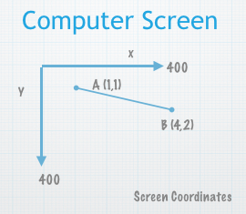

# Programming Language:  
##JavaScript and the Processing.js Library

In this course, students will learn to write programs using JavaScript.  They will also learn how to use the [Processing.js](http://processingJS.org) Library functions.  This course will focus on functional programming, with a focus on program design using diagrammatic modeling concepts.

## Development Environment:  
###Khan Academy - Live Coding IDE

- Canvas:  400 x 400 px

- O,O is at top left corner

- Pixels are the units of the canvas

### Screen Coordinates:  
