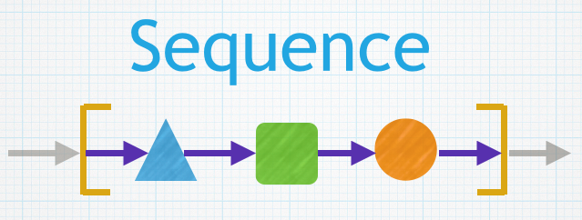
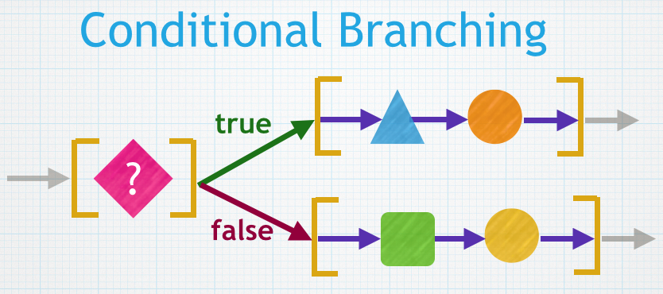

#Conditional Branching:  if, else

###Default Mode:  Sequential Execution
Up until now, our programs have been structured as a sequence of statements that are executed in the order that the code is arranged in our programs, we have relied on sequential program structure.   In order to create more sophisticated programs, we need to utilize conditional branching structure in our programs.

###Conditional Branching Structure
The structure and logic of conditional branching mirrors the process that we all instinctively use, we make decisions.  What we might not realize is the  

