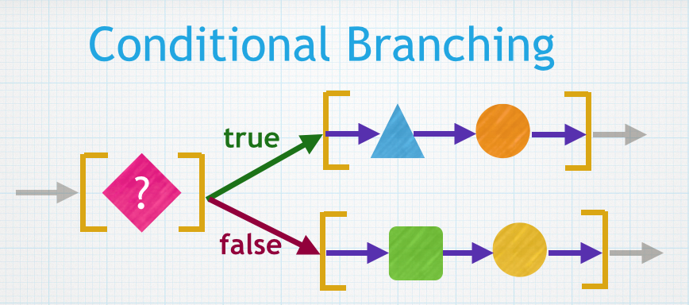

#Conditional Branching:  if, else

Up until now, our programs have been structured as a sequence of statements that are executed in the sequence that the code is ordered in our programs, we have relied on sequential program structure.   

