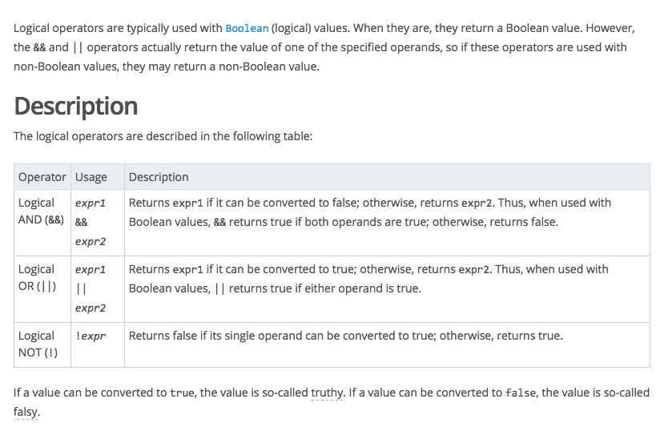

# Logical Operators

[See Javascript Reference](https://developer.mozilla.org/en-US/docs/Web/JavaScript/Reference/Operators/Logical_Operators#Short-Circuit_Evaluation)

Logical operators are typically used with Boolean (logical) values. When they are, they return a Boolean value. However, the && and || operators actually return the value of one of the specified operands, so if these operators are used with non-Boolean values, they may return a non-Boolean value.

Description
The logical operators are described in the following table from the [Javascript Language Reference at Mozilla.org](https://developer.mozilla.org/en-US/docs/Web/JavaScript/Reference/Operators/Logical_Operators#Short-Circuit_Evaluation):
	

