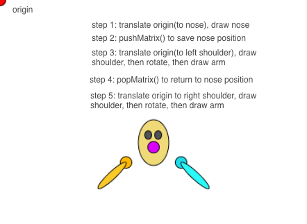

#Transforms

Transformations are functions that can be used to change the physical configuration of the drawing canvas.  This can provide powerful design techniques.  The following transformations can be applied to the canvas: [See Tutorial](https://www.khanacademy.org/computing/computer-programming/programming-games-visualizations/programming-transformations/a/translation).  Based on this [Processing Tutorial](https://www.processing.org/tutorials/transform2d/)

  -    **translate( x, y )**   //move the origin to position(x,y)

  -    **rotate( angle )** // rotate the canvas through angle ( degrees / radians )

  -    **scale( x, y )** //  changes the size of the canvas: larger or smaller - also impacts strokeWeight
  

###Transformation Matrix
The transformation ``matrix`` is a global table that stores the configuration information of the canvas.  The default values for the matrix can always be reset by calling the function: ``resetMatrix()``.  This resets the canvas so the origin is at the upper left corner, and insures that there's no rotation or scaling.

###resetMatrix()
The resetMatrix() function sets the origin back to the original, upper-left corner of the canvas, and it removes all other pushMatrix, popMatrix (snapshot) data from the transformation-history stack.  

###pushMatrix() / popMatrix()
The `pushMatrix()` function stores the current state of the transformation Matrix in a **stack** structure, it is like a snapshot is taken of the current transform values and that is saved for later use.  Then the `popMatrix()` function can be used to retrieve the most recent state of the transformation matrix that was stored on the **stack**

Below is a simple example of how transforms can be used to create a simple character, we can use pushMatrix() and popMatrix() to save and retrieve canvas configuration settings as noted in the image below.  pushMatrix and popMatrix are designed to be used together, you call pushMatrix when you know that you will want to return to the current configuration.  This is common when trying to create symmetry relative to a fixed reference point like the character's nose. 

[Link to Code Example: Khan Academy Program with Transforms](https://www.khanacademy.org/computer-programming/transformations-pushmatrix-popmatrix/5558061535199232)
